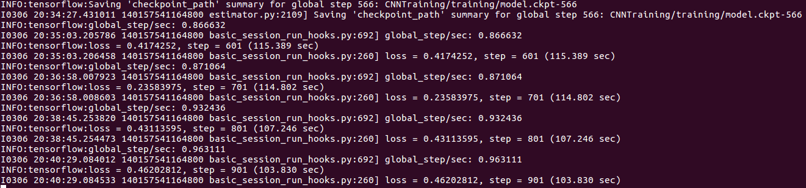
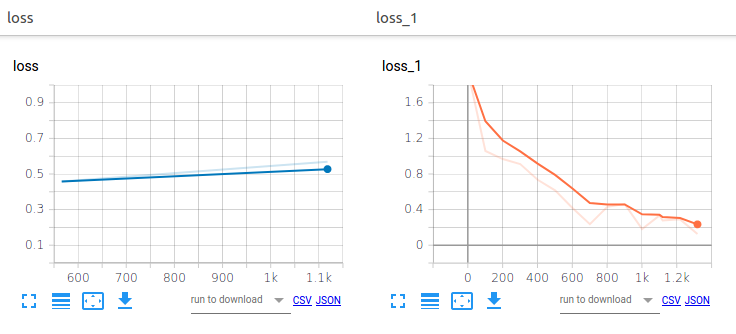

# CNNTraining
This repository provides the necessary instructions for training a Tensorflow Convolutional Neural Network , for the Purpose of identifying Platanus hispanica and Celtis australis trees in the streets of Barcelona, Spain.

This workflow has been developed using Gilbert Tanner's [tutorial](https://gilberttanner.com/blog/creating-your-own-objectdetector) on how to use Tensorflow for creating a live object detection model.

## Contents
In order to create a CNN using Tensorflow's object_detection API, you need (and we provide in this repo):
1. The **image files** for training and testing.
These .jpg files can be found under 'images' and are further separated in 'train' and 'test' folders.
2. An **.xml file** for each of the abovementioned images, which contain the data for locating the objects of interest within the images.
These files can be found in the same folder as their respective .jpg image.
See [information](https://github.com/BrimKing/LabelImgTreeSpecies/blob/master/README.md) on how to create such files using [labelImg](https://github.com/tzutalin/labelImg).
3. A **labelmap**, that contains the list of classes of the objects of interest.
In our case the file is called labelmap.pbtxt and can be found under 'training' folder. It contains only 2 classes, Platanus_x_hispanica and Celtis_australis.
4. A **.config file** that describes the pipeline of the CNN that is going to be used. In our case is called faster_rcnn_inception_v2_pets.config (as we are using Faster R-CNN architecture) and can be found under 'training'.
5. **Folder faster_rcnn_inception_v2_coco_2018_01_28** which containes the necessary information to build a Faster R-CNN model.
6. **Python scripts** xml_to_csv.py and generate_tfrecords.py, that were initially found in [datitran/raccoon_dataset](https://github.com/datitran/raccoon_dataset) repository and have been modified to fit this process' s needs.
7. A **'time_saver' folder**, that contains files that can be created during the process, but can also be found there, in case you want to save time and skip some steps. These files are: 
    * .csv files, created by xml_to_csv.py
    * .record files, created by generate_tfrecords.py
8. Finally, under 'doc_imgs', we have placed documentation images, whose only purpose is to support this tutorial and take no part in the actual process.


## Prerequisites
To build a Tensorflow object detection model, you must have the following prerequisites installed on your system:
1. Environment with Python > 3.6.10.
2. The following commands will install almost all packages that you will need:
```Bash
pip install tensorflow==1.15.2
pip install pandas
```
3. Download or git clone [this](https://github.com/tensorflow/models) repository.

The instructions above should end in acquiring locally the tree-structured project directories of Tensorflow. \
Example: \
-models \
&nbsp;&nbsp;&nbsp;&nbsp;-research \
&nbsp;&nbsp;&nbsp;&nbsp;
&nbsp;&nbsp;&nbsp;&nbsp; -object_detection \
&nbsp;&nbsp;&nbsp;&nbsp; &nbsp;&nbsp;&nbsp;&nbsp;... \
&nbsp;&nbsp;&nbsp;&nbsp; ...

4. Navigate to models/research directory and run
```Bash
pip install .
export PYTHONPATH=$PYTHONPATH:`pwd`:`pwd`/slim
```
## How to use this project

1. Download or git clone the repository and copy it under object_detection. Now your file structure should be: \
-models \
&nbsp;&nbsp;&nbsp;&nbsp;-research \
&nbsp;&nbsp;&nbsp;&nbsp;
&nbsp;&nbsp;&nbsp;&nbsp; -object_detection \
&nbsp;&nbsp;&nbsp;&nbsp;
&nbsp;&nbsp;&nbsp;&nbsp; &nbsp;&nbsp;&nbsp;&nbsp; -CNNTraining \
&nbsp;&nbsp;&nbsp;&nbsp; &nbsp;&nbsp;&nbsp;&nbsp; ... \
&nbsp;&nbsp;&nbsp;&nbsp; ...


2. Navigate to models/research/object_detection/CNNTraining and run
```Bash
python xml_to_csv.py
```
This will create 2 .csv files under 'images' that combine all the .xml files that correspond to every image. Note that you get separate files for training and testing the CNN.
You can skip this step by using the .csv files provided in 'time_saver' folder. Just copy and paste train_labels.csv and test_labels.csv directly under 'images'.

2. Now we have to turn the .csv files into a format that can be manipulated by Tensorflow. Under CNNTraining, run: 
```Bash
python generate_tfrecords.py --csv_input=images/train_labels.csv --image_dir=images/train --output_path=train.record

python generate_tfrecords.py --csv_input=images/test_labels.csv --image_dir=images/test --output_path=test.record
```
were:
* csv_input: the path to the .csv file
* image_dir: the path to the directory that contains the images we will use for building the model.
* output_path: the path to the new .record file that will be created.

You can skip this step by using the .record files provided in 'time_saver' folder. Just copy and paste train.record and test.record directly under CNNTraining.
 
3. Navigate to models/research/object_detection directory. If all the previous steps have been followed closely, it is enough to run:
```Bash
python model_main.py --logtostderr --model_dir=CNNTraining/training/ --pipeline_config_path=CNNTraining/training/faster_rcnn_inception_v2_pets.config
```
and watch the model being built.

4. You can stop the training with CTRL+C when you are satisfied the loss achieved. The loss can be monitored either by checking the console output:

*Fig. 1 - Console output*

or by checking TensorBoard. TensorBoard is Tensorflow's tool for visualizing metrics such as loss and accuracy. It can be activated by navigating to CNNTraining directory and running
```Bash
tensorboard --logdir=training
```
where logdir is the directory whose activity we want to log. 

Then, you can simply open a browser window to [localhost:6006](localhost:6006) and check the model's histograms, graphs, etc.


*Fig. 2 - Tensorboard output*

5. The last step is to export the inference graph. Under 'training' you should be able to see files of the format model.ckpt-XXXX.index, where XXXX stands for the number of the checkpoint. Note down these 4 digits and navigate to models/research/object_detection and run the following command, after replacing 'XXXX' accordingly:

```Bash
python export_inference_graph.py --input_type image_tensor --pipeline_config_path CNNTraining/training/faster_rcnn_inception_v2_pets.config --trained_checkpoint_prefix CNNTraining/training/model.ckpt-XXXX --output_directory CNNTraining/inference_graph
```
You can notice a new folder under 'CNNTraining' called 'inference_graph'. That folder contains your trained model.
